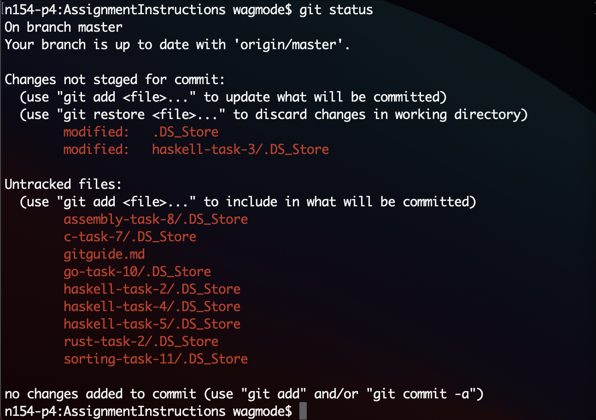

# The git guide to git good
For working in projects, proper `git` usage is important, especially when working with other developers. Therefore, i have created this eminent guide to teach y'all to `git`.

**_Author_: Tobias Hansson <tohanss@kth.se>**

## Notes and terminology
* I want to preface that `git` and `github` are different things, so when either is referenced, assume i am not talking about the other.
> You can think of `git` as what you do locally on your computer and `github` as the website.
* I will be marking `key words` like `this`, they are probably worth taking note of.
* When running or showing an example `command`, they will be presented like this: `$ git do-stuff`. The `$` is a common character used to represent your terminal prompt, it is far shorter than `<gibberish>:<current directory> <username>$` which is what my computer uses.
* Anything in `<>` is replaceable in this text with whatever is appropriate for the situation

## Basic usage
This section covers the most basic usage of `git`, something that you have probably already seen a bunch of. When working alone, you have probably already `cloned` and `pushed` different `repos` many times, but i will be sure to go over them again here so a base-line is established.

### Status
Before doing anything, it could be a good idea to make sure you are doing what you think you are doing. This can achieved by running `$ git status`, which displayes any changes to your `repository`



Here we can make sure that we are on the proper `branch`. We also see if we have any `untracked` or not `marked for commit` changes (marked in red). Any green changes will be included if you run `$ git commit`. 

### Commit
Speaking of `commit`, you should already know what this does, but there are some peculiars as to how it works. For example, how do we know what gets `commited`? 

First of all, files can be `staged for commit` using `$ git add <file(s)>`. 

We can use the image of `$ git status` above as an example. Put simply, if we only run `$ git commit`, only the files that are `staged for commit` (or green) will be `tracked`. These are files that you have run `$ git add` on. 

If you instead run `$ git commit -a` (`-a` is for `all`), all changes under `Changes not staged for commit` will be `tracked`. This means you dont have to run `git add <file(s)|-A>` beforehand. These are files that we have `commited` before but have since made changes to.

What does it mean to `track` a file, you may ask by now. Well, simply put, it means that `tracked` files will be included when running `$ git push`

> Note that `commits` are locked to the `branch` you are on, meaning that once you have `commited` changes, they would have to be `reset` to be `unstaged` again.

### Branches
Now, if i just told you branches are usefull for working in parallel, i would be doing you a disservice, so instead i will be going over a bit how git _actually_ works.

## The ./git directory
Everything that you do in a `git repository` is saved inside a hidden directory simply named `.git`. This folder is what makes a `repository`. You can check that you have one by running `$ ls -la`, which will list _everything_ (hopefully) in your current directory.

Inside this directory we find many essentials, such as what `commit` and `branch` we are currently on, known as the `HEAD`. We can also find the magic of `git` `version control`.

The way `git` saves changes is by doing just that, it only saves changes, this is how git can move between `commits` and `branches` and change your `file system`! If we are inside a `repo` with only the main branch, these changes can be represented as a line. 

> Note: This is a simplification so that you, the reader, can more easily understand what your `git` commands actually do. This explanation is technically incorrect, as there are details missing, such as the tree structure, but i've included an image to help represent this


As you can see in the image, there can be `pointers` between files, so our `repo` is not necessarily a straight line. I will refer to our `repo` structure as the `tree`.

Starting out we could have a repo like this:

```
Start -> Commit1 -> Commit2
```

### Branches (cont)

Each element in the above sequence is it's own element with their own IDs. Simple enough, now let us introduce branches from `Commit1` and onwards. To create a new branch, simply use the command `$ git switch -c <branch-name>`, using `$ git switch <branch-name>` (that is, without `-c`, we simply move to another branch).

```
Branch2:          Commit1 -> Commit3
                     ^
Branch1: Start -> Commit1 -> Commit2
```

Creating `branch2` simply creates a new `tree` with everything in `branch1` up untill the `branch` is created. Being on a `branch` simply says "Do the changes in _this_ tree". This is saved inside the `HEAD`, which is simply a `pointer` to the current `branch` and `commit`. A common command in git is `$ git reset HEAD^x`, which is to reset to x `commits` before the current!

Ok, so we can work on `branches` in parallel, we get that, but is that all? No of course not! `Branches` would be almost useless if we could not `merge` them! `Merging` `Branch2` into `Branch1` would look something like this:

```
Branch2:          Commit1 -> Commit3 ---|
                     ^                  | 
Branch1: Start -> Commit1 -> Commit2 ---| > Merge commit2+3
```

A merge is nothing special, just magic _tm_. Imagine that you (manually) look at both branches and say to yourself: "What changes to i have to take fron Branch2 into Branch1?". This is precisely what git does. Git looks at both branches and creates a commit for you that applies any changes from the other branch, there is no difference from doing that yourself (except that it would be really boring). So the next time you think branches and merging is complicated, it really isn't!

Aside from being usefull locally, branches also make co-operation easier! If a remote is set up, such as github, pushing a branch will make that branch availiable on the remote as well, meaning that another user can fetch that branch and work inside it and create their own commits. 

The most usefull usage, however, is merging directly on the remote. Pushing on the main branch is risky, therefore it is a good idead to do it on the remote. When pushing a branch, github will do a lot of the heavy lifting for you by giving you the option to create `pull requests`. A pull request is simply a fancy interface for merging branches like in the example above. In a pull request, you can directly see any changes made and provide feedback to other developers, you can also see beforehand if the branch can be merged into main, pressing the "Merge" button on github does nothing more than running the command: `$ git merge` command, like you would locally.