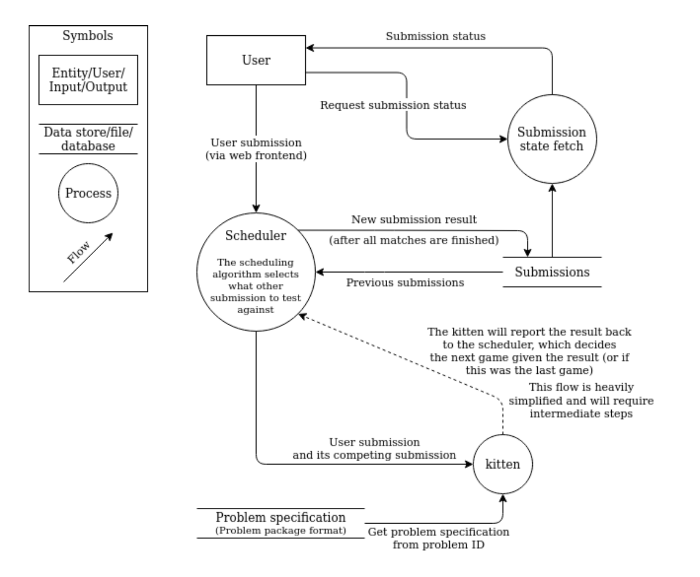

# DD1349 | Week 2

## Assignment
### Begin writing
"Where do I start?" - Question of the week.

Subassignments:

1. Produce an image which describes how your application/system works.
2. Begin on your project. Divide the work by source code distinct partitions of _must-haves_.
3. Entertain a fashionable README file.

See week 0 and 1 for project expectations.

### Planned coding

> Once upon a time, there was two programmers collaborating on a project. They planned to write two features each, one dependent on the other. Both knew what the features should do. A weekend later they merge their respective work, but nothing runs. They had the what, but not the how.

Simply, if two structures are supposed to interact, deside the output and inputs of those structures. Learn to design your code before writing it. 

It could be as simple as telling a bud: "Hey, I need to call these functions and expect these outputs from these inputs."

#### Architecture

Most often a developer team will produce a clear overview of the architecture of the system at hand. This arcitecture can be a UML graphic or simular. All the way from high level, to low level class diagrams.

### Don't forget to use branching

### Have well documented code

See `doc-example/` for how to document well in Rust.

Generate documentation with `cargo doc`. See your newly generated web documentation by opening `./target/doc/simplest/index.html`.

Run documentation tests with `cargo test`.

Note: Web documentations can only be generated for single files or library crates, not binary crates.

_Success:_
