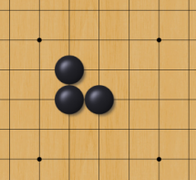
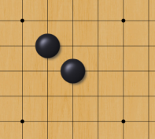
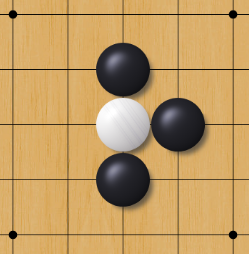
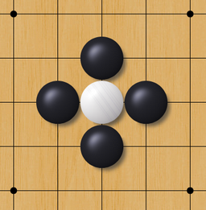

# DD1338 Week 16

You thought Haskell was weird? Well get ready to do some *real* code-wizardry. This week we are going to be learning Prolog by implementing a part of everyone's favourite boardgame: [Go](https://en.wikipedia.org/wiki/Go_(game))

## Getting started with Prolog

### SWI-Prolog

1) Install [SWI-Prolog](https://www.swi-prolog.org/). _As a pleb (Windows user), you are entitled to the SWI-prolog-command-prompt profile to add to your Windows Terminal settings. You're welcome._
```json
{
    "acrylicOpacity": 0.75,
    "closeOnExit": true,
    "commandline": "cmd.exe /c \"swipl\"",
    "guid": "{1597a4d0-b666-4b1f-a7d3-79af62638679}",
    "icon": "C:\\Program Files\\swipl\\swipl.ico",
    "name": "SWI-Prolog",
    "useAcrylic": true
}
```
2) Make sure that your environmental variable is set.

Congrats dear programmer. You can now compile and run your Prolog files by entering the following command.

_In your terminal/powershell_:
```
swipl path/to/my-file.pl
```
_In your SWI-Prolog environment_:
```prolog
['path/to/my-file.pl'].
```

To exit (at least on Mac), use `ctrl + c`, then `e`.

### Prepare for your assigment

1) Create a repository named `<KTH_ID>-task-15`.
2) Clone your newly created repository.
3) Create one `.pl` file for the entire assignment.

For help with code setup, begin by copying the contents of `./template.pl` into your `.pl` file.


## Assignment

Your assignment is to implement one (or more) predicates that handle some of the functionality of the game [Go](https://en.wikipedia.org/wiki/Go_(game)). (Quick [video](<https://www.youtube.com/watch?v=cFVM_hwh56s>) explaining the rules)

Your functions only need to be able to handle boards of size 9x9, but it would be nice if they could handle bigger (or smaller) board sizes.

The file 'template.pl' contains a template for how to read input and a simple predicate that checks the position at (Column, Row) and returns true if it contains a stone.

There are two example boards that you can test your solution on.

### Life or death

Implement a function (called a predicate in Prolog) that determines wether a group of stones is [dead or alive](#Life). The predicate should take a position and a board as arguments (see the [template](template.pl)).

`is_alive(X, Y, Board):-` or similar.

### *Optional:* Make moves and change gamestate

Implement a predicate that takes a move and a board and updates the board according to the rules. You do not need to account for the [Ko](https://en.wikipedia.org/wiki/Go_(game)#Ko_rule)-rule (i.e repeating moves) but if the move kills a group then that group should be removed from the board. The function should take a position, the color of the placed stone and a board, and bind the new board to the fourth variable. 

I.e `place_stone(X, Y, Color, Board, New_Board):-` or similar.

### *Optional:* Find all possible moves

Implement a predicate that determines all possible moves, given a color and a board. The function should take a color and a board, and bind the possible moves to the third variable.

I.e `possible_move(Color, Board, Move):-` 

> Note: The return-variable `Move` can either be a list of moves, or you can make use of Prolog's language features and make the function return several times. 


## Definitions
### Groups
A group is defined as one or more stones of the same color that are horisontally or vertically adjecent to eachother. 

If two stones share an adjacent stone of the same color they are considered to be part of the same group. 

This is a group:



These are two seperate groups



### Life
A group is alive if it has atleast one liberty. A liberty is a horisontally or vertically adjacent spot on the board that isn't covered by another stone. A stone at the edge of the board is considered to have one less liberty. Coversely, a stone at the corner of the board is considered to have two less liberties. 


The white group is alive:



The white group is now dead and should be removed from the board:



### Loading files
This will load the board contained in `alive_example.txt` and bind it to B.
```prolog
load_board('alive_example.txt', B).
```
